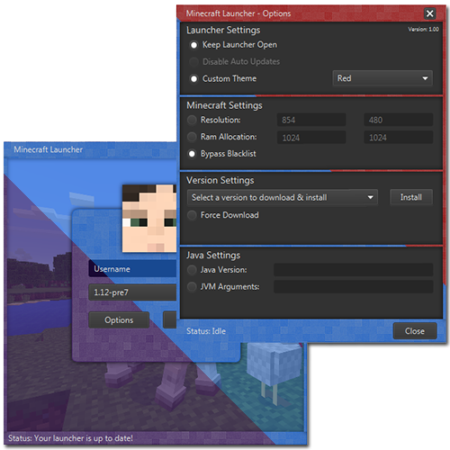
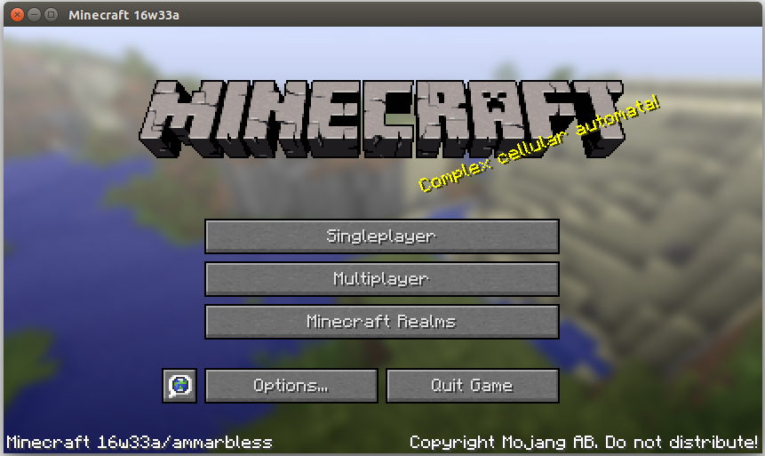

# MiniLauncher, a lightweight minecraft launcher with support for offline mode
The purpose of the launcher is to provide users the ability to download, install and run Minecraft.

Overview:

Game running:

Big thanks to @ammarx for making https://github.com/ammarx/TagAPI_3 and 
https://github.com/ammarx/TagLauncher_3, the two projects this project was originally based on,
 and releasing it under MIT.
